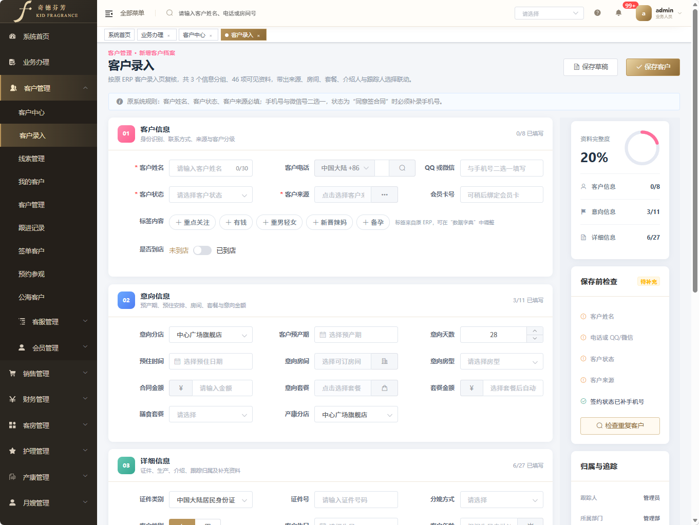
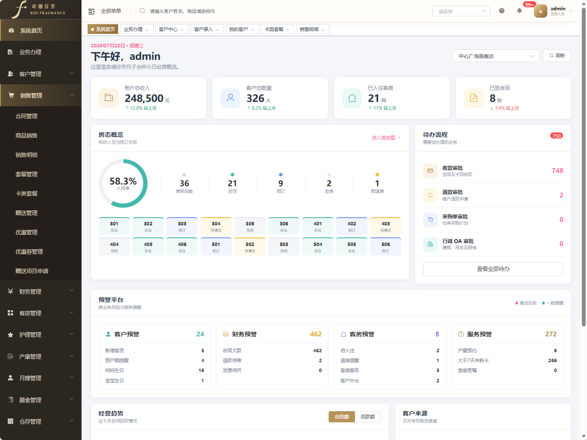

# 奇德芬芳月子会所 ERP

<p align="center">
  
</p>

<p align="center">
  面向月子会所的客户、销售、财务、客房、护理、产康、膳食与仓存一体化业务管理系统
</p>

<p align="center">
  
  
  
  
</p>

## 项目简介

奇德芬芳月子会所 ERP 是一套按真实月子会所业务流程建设的管理系统。项目覆盖菜单、查询条件、工具栏、业务表单、角色权限和流程规则，并通过 MySQL 后端统一承载核心业务数据。

当前已经打通首条真实业务主链路：

```text
客户建档 → 合同签订/审核 → 收款登记/审核 → 订房 → 入住
```

该链路通过 Python API 与 MySQL 5.7 事务落库，不再依赖 JSON 本地数据；登录、菜单、按钮、接口和门店数据范围使用同一套角色权限进行校验。

本项目的管理端界面基于 [vue-element-admin](https://github.com/PanJiaChen/vue-element-admin) 二次开发，并针对奇德芬芳品牌完成金白主题、导航、Logo、业务菜单和工作台改造。

## 界面预览

<table>
  <tr>
    <td width="50%" align="center">
      
      <br>
      <sub>客户管理 · 客户录入、完整度检查与归属追踪</sub>
    </td>
    <td width="50%" align="center">
      
      <br>
      <sub>系统首页 · 经营概览、房态、待办流程与业务预警</sub>
    </td>
  </tr>
</table>

> 截图中的客户和员工信息均为演示数据，不代表真实业务记录。

## 当前实现

### 核心业务

- 客户建档、手机号重复校验、客户状态流转
- 六类合同、套餐、价格、折扣率及合同审核
- 收款登记、收款审核、未入账金额和欠款计算
- 房间主数据、日期冲突校验、订房和入住
- 业务操作审计及前后状态记录
- 套餐版本、房型、入住天数、门店、生效日期与权益模型

### 组织与权限

- 租户、门店、部门、岗位、员工和账号
- 用户—角色、角色—权限、用户—门店关系
- 角色、菜单、按钮和门店数据权限资源统一管理
- 管理员、销售经理、产康师、客房管家主链路权限验证
- 前端菜单、操作按钮和后端 API 双重鉴权

### ERP 模块

- 客户管理
- 销售管理
- 财务管理
- 客房管理
- 护理管理
- 产康管理
- 月嫂管理
- 膳食管理
- 仓存管理
- 商城管理
- 风控服务
- 查询报表
- 基础资料
- 系统设置

除核心主链路外，部分模块当前仍处于字段级复刻或接口逐步接入阶段，不能视为全部生产功能已经完成。

### 多端应用

`apps/` 提供新的多端工作区：

- `apps/admin`：Vue 3 + Element Plus 管理端
- `apps/staff`：员工端 uni-app
- `apps/mom`：宝妈端 uni-app
- `apps/beauty`：美容/产康独立端代码
- `apps/demo`：多端聚合演示
- `apps/h5dist`：H5 构建产物
- `apps/mpdist`：微信小程序构建产物

## 技术架构

| 层级 | 技术 |
| --- | --- |
| 现有 ERP 前端 | Vue 2、Vue Router、Vuex、Element UI、Axios |
| 新管理端 | Vue 3、TypeScript、Vite、Pinia、Element Plus |
| 移动端 | uni-app、Vue 3、H5、微信小程序 |
| 后端 | Python HTTP API |
| 数据库 | MySQL 5.7、事务、外键、迁移脚本 |
| 权限 | 用户、角色、权限、门店范围、按钮权限、服务端鉴权 |
| 测试 | Python 流程测试、Node.js 逻辑测试、浏览器回归 |

## 项目目录

```text
.
├─ apps/                         # 管理端、员工端、宝妈端与构建产物
├─ database/mysql/migrations/    # MySQL 5.7 数据库迁移
├─ docs/                         # 运行说明、权限设计、业务和交接文档
├─ mock/                         # 未接入真实后端页面的兼容数据
├─ scripts/                      # 初始化、迁移、权限导入及测试脚本
├─ server/                       # Python ERP API
└─ src/                          # Vue 2 ERP 前端
```

## 环境要求

- Node.js
- npm 或 pnpm
- Python 3
- MySQL 5.7
- Git

请勿把数据库密码、管理员密码或令牌写进项目文件。所有凭据均通过环境变量传入。

## 快速启动

### 1. 获取代码并安装依赖

```powershell
git clone https://github.com/397174604-svg/yuezi-erp.git
Set-Location yuezi-erp
pnpm install
```

### 2. 配置本地环境

```powershell
$env:ERP_DB_PASSWORD='<本机 MySQL 密码>'
$env:ERP_BOOTSTRAP_ADMIN_PASSWORD='<管理员登录密码>'
$env:ERP_TOKEN_SECRET='<至少 32 位随机字符串>'
```

首次部署到新数据库时执行：

```powershell
npm run migrate:mvp
npm run bootstrap:mvp
npm run bootstrap:mvp:roles
```

### 3. 启动前后端

```powershell
npm run dev:mvp
```

- 前端：`http://localhost:9527/`
- API：`http://127.0.0.1:3000/`

也可以分别启动：

```powershell
npm run api:mvp
npm run dev
```

## 多端应用

构建员工端和宝妈端 H5：

```powershell
Set-Location apps
pnpm install
pnpm run build:all
```

构建微信小程序：

```powershell
pnpm run build:mp:all
```

构建新的 Vue 3 管理端：

```powershell
Set-Location apps\admin
pnpm install
pnpm run build
```

## 验证

检查数据库与迁移状态：

```powershell
npm run verify:mvp
```

执行角色权限回归：

```powershell
npm run test:mvp:rbac
```

执行自动清理的完整主链路验收：

```powershell
python scripts/smoke-mvp.py
```

执行多端核心逻辑测试：

```powershell
node --test apps\staff\test\logic.test.js apps\mom\test\logic.test.js apps\beauty\test\logic.test.js apps\demo\test\tabbar.test.js
```

## 文档

- [MVP 运行与后续建设说明](./docs/MVP运行与后续建设说明.md)
- [项目交接文档](./docs/交接文档/奇德芬芳ERP-项目交接文档-2026-07-27.md)
- [真实业务与 MySQL 设计](./docs/database/奇德芬芳ERP-真实业务ER与MySQL设计-2026-07-27.md)
- [多端应用迁移说明](./apps/CONVERSION.md)

## 安全说明

- 仓库不保存真实数据库密码、账号密码或访问令牌。
- 真实业务截图、抓取缓存和含隐私的本地资料不会提交到公开仓库。
- 生产环境需要单独配置 HTTPS、密钥管理、数据库备份、日志审计和监控告警。

## 开源基础

本项目管理端基于 [PanJiaChen/vue-element-admin](https://github.com/PanJiaChen/vue-element-admin) 进行二次开发。原项目版权及许可证归原作者所有，本仓库保留相应许可证文件。
