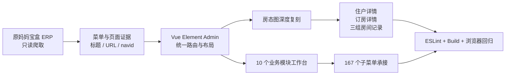
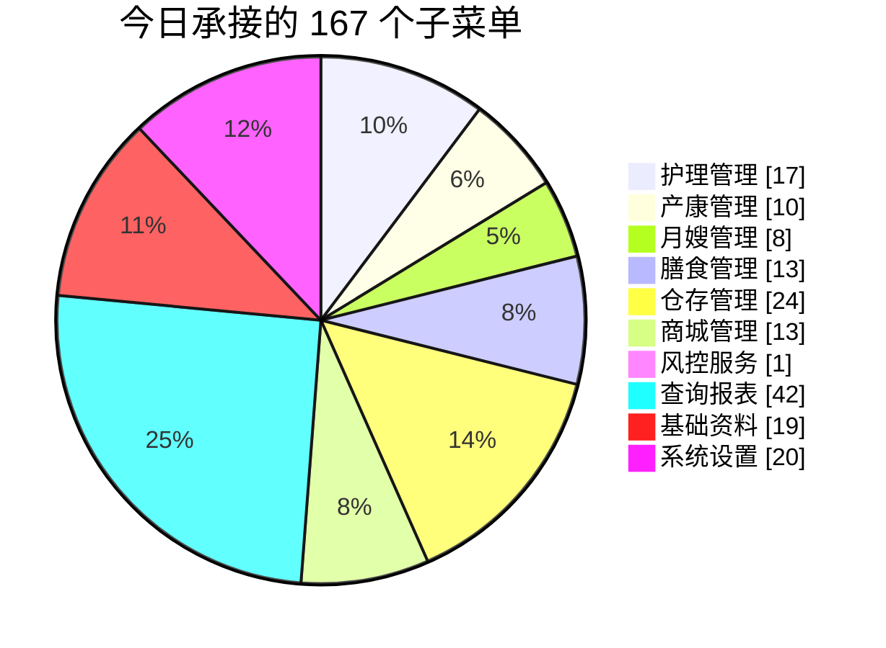
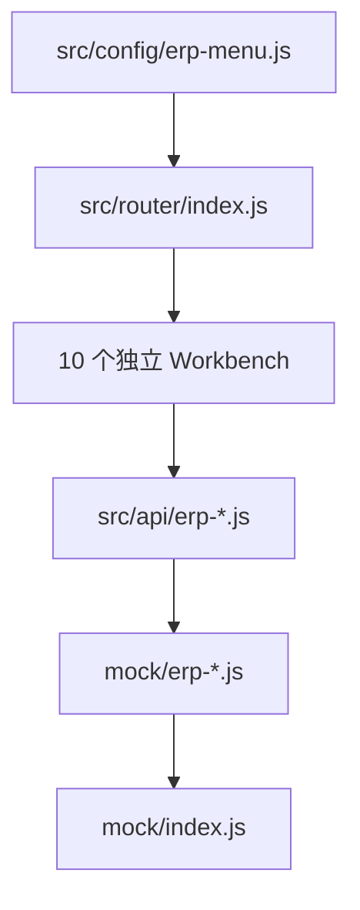

# 2026-07-23 月子系统 ERP 项目日报

> [!tip] 横向一页总览
> 打开 [[2026-07-23 月子系统ERP项目日报-横向|横向 Canvas 看板]]，可在一个横向画布中查看今日全部核心成果。

> [!summary] 今日一句话
> 完成房态图住户/订房详情的字段级复刻，同时用多个 Agent 并行搭建护理、产康、月嫂、膳食、仓存、商城、风控、报表、基础资料和系统设置 10 个模块，共承接 **167 个子菜单**，并完成统一路由、Mock、构建与浏览器回归。

关联笔记：[[月子中心]] · [[项目结构]]

## 今日成果总览



| 指标 | 今日结果 |
|---|---:|
| 并行复刻模块 | 10 个 |
| 已承接子菜单 | 167 个 |
| 原菜单 URL / navid | 已批量只读核验 |
| 本地首菜单路由回归 | 10/10 通过 |
| 房态详情交互回归 | 通过 |
| 控制台错误 | 0 |
| ESLint | 通过 |
| 生产构建 | 通过 |

## 1. 房态图继续做深

今天重新核对原 ERP 房态图，并完成以下交互：

- 点击 201 房间内任意住户，打开“客户明细”。
- 客户明细承接原系统 17 个页签。
- 首个“客户详细信息”页按原系统字段分组复刻。
- 点击房间右上角“详情(1)”，打开“订房详情”。
- 订房详情补齐当前入住信息。
- 增加三个横向列表：
  - 客户的房间记录
  - 过去入住信息
  - 未来预定信息
- 住户卡补齐剩余天数/总天数与入住时间段。

> [!success] 浏览器验证
> 住户弹窗核心字段、17 个页签、订房详情字段以及三组列表表头全部通过；页面控制台错误为 0。

![[附件/2026-07-23-房态图.png]]

## 2. 十个模块并行落地



| 模块 | 子菜单 | 今日落地内容 | 当前证据等级 |
|---|---:|---|---|
| 护理管理 | 17 | 独立配置、工作台、API、Mock、交接文档 | 菜单与 URL 已核验 |
| 产康管理 | 10 | 预约、排班、执行、耗卡领域工作台 | 菜单与 URL 已核验 |
| 月嫂管理 | 8 | 档案、档期、合同、派工、结算入口 | 菜单与 URL 已核验 |
| 膳食管理 | 13 | 餐单、菜品、采购、送餐、餐卡入口 | 菜单与 URL 已核验 |
| 仓存管理 | 24 | 采购、入出库、盘点、调拨、库存报表入口 | 菜单与 URL 已核验 |
| 商城管理 | 13 | 商品、订单、课程、内容与社区入口 | 菜单与 URL 已核验 |
| 风控服务 | 1 | 悦禧风控独立工作台 | 菜单与 URL 已核验 |
| 查询报表 | 42 | 销售、客房、财务、护理、服务报表入口 | 菜单与 URL 已核验 |
| 基础资料 | 19 | 职员、项目、物料、客房、供应商等入口 | 菜单与 URL 已核验 |
| 系统设置 | 20 | 组织、用户、权限、流程、消息、参数入口 | 菜单与 URL 已核验 |

> [!important] 报表数量纠偏
> 当前仓库和原菜单证据对应的是 **42 个查询报表**，不是早期估计的 43 个。本次没有为了凑数虚构第 43 项。

## 3. 原 ERP 证据补齐

重新登录原 ERP 后，只读提取了隐藏菜单树，完成：

- 10 个模块菜单标题与顺序核验。
- 原页面 URL 与 `navid` 批量记录。
- 建立统一证据映射：
  - `src/config/original-page-evidence.js`
- 基础资料、月嫂管理、系统设置同步回填页面身份。
- 全部演示数据继续使用脱敏 Mock，没有复制真实客户、员工、金额、排期或健康信息。

## 4. 统一工程接入



今日完成：

- `erp-menu.js` 增加 10 个专属 `pageType`。
- `router/index.js` 注册 10 个懒加载工作台。
- `mock/index.js` 注册 10 组模块 Mock。
- 建立总交接文档：
  - `PARALLEL_MODULE_MIGRATION_HANDOFF.md`

![[附件/2026-07-23-系统设置工作台.png]]

## 5. 质量验证

```text
ESLint
  src/config/**/*.js
  src/api/erp-*.js
  src/views/erp/**/*.vue
  mock/erp-*.js
  mock/index.js
  src/router/index.js
结果：通过

npm.cmd run build:prod
结果：通过
```

生产构建仅保留项目原有的两类体积提示：

- asset size limit
- entrypoint size limit

浏览器回归通过的首菜单路由：

- `/nursing/item-1`
- `/recovery/item-1`
- `/matron/item-1`
- `/diet/item-1`
- `/warehouse/item-1`
- `/mall/item-1`
- `/risk/item-1`
- `/report/item-1`
- `/basic/item-1`
- `/system/item-1`

## 当前边界

> [!warning] 不能过度声明
> 房态图本轮指定的住户详情和订房详情已经按原页面重新爬取并实现；其余 10 个模块当前主要达到 **Visible / Mock** 阶段。菜单标题、顺序、URL、navid 有原站证据，但页面内部筛选字段、下拉全集、默认值、按钮顺序、表头、弹窗、联动及状态机仍需要逐页二次核验。

尚未完成：

- 真实后端接口与数据库持久化。
- 全部页面内部字段级一比一核验。
- 审批、金额、库存、耗卡和权限规则对账。
- 历史数据迁移。
- 打印、导出模板逐页复刻。

## 明日建议

1. 优先逐页核验护理管理和产康管理，形成可执行主链路。
2. 按页面记录工具栏、查询条件、下拉全集、表头和新增/编辑弹窗。
3. 再核验膳食执行与仓存扣减联动。
4. 最后核验审批、金额、权限、报表口径及历史数据。
5. 每完成一页即更新 `verified` 状态与对应交接文档，避免“页面看起来完成、实际字段未验证”。

---

项目目录：`C:\Users\39717\Desktop\月子系统erp`

核心交接：`PARALLEL_MODULE_MIGRATION_HANDOFF.md`
